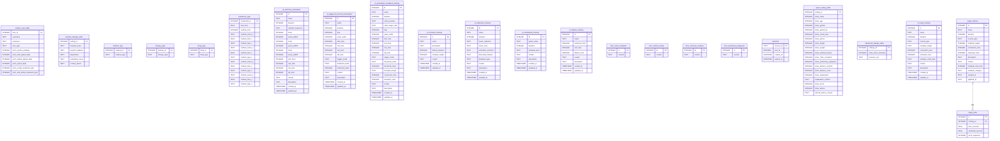

```mermaid
erDiagram
    system_user_table {
        INTEGER user_id PK
        TEXT username
        TEXT password
        TEXT user_type
        INTEGER perm_system_settings
        INTEGER perm_edit_patient_data
        INTEGER perm_delete_patient_data
        INTEGER perm_export_data
        INTEGER perm_create_treatment_plan
        INTEGER perm_edit_delete_treatment_plan
    }
    hospital_manage_table {
        INTEGER setting_id PK
        TEXT hospital_name
        TEXT hospital_address
        TEXT department
        TEXT subsidiary_name
        TEXT contact_phone
    }
    medical_type {
        INTEGER medical_id PK
        TEXT medical_type
    }
    therapy_type {
        INTEGER therapy_id PK
        TEXT therapy_type
    }
    body_type {
        INTEGER body_id PK
        TEXT body_type
    }
    treatement_type {
        INTEGER treatement_id PK
        REAL total_time
        INTEGER method_num
        TEXT method_name_1
        REAL method_time_1
        TEXT method_type_1
        TEXT method_name_2
        REAL method_time_2
        TEXT method_type_2
        TEXT method_name_3
        REAL method_time_3
        TEXT method_type_3
        TEXT method_name_4
        REAL method_time_4
        TEXT method_type_4
    }
    pf_electrical_stimulation {
        INTEGER id PK
        TEXT name
        INTEGER duration
        TEXT variable_frequency
        INTEGER freq1
        INTEGER pulse_width1
        INTEGER freq2
        INTEGER pulse_width2
        INTEGER freq3
        INTEGER pulse_width3
        INTEGER stim_time
        INTEGER rest_time
        INTEGER rise_time
        INTEGER fall_time
        TEXT creator
        TEXT description
        TIMESTAMP created_at
        TIMESTAMP updated_at
    }
    pf_triggered_electrical_stimulation {
        INTEGER id PK
        TEXT name
        INTEGER duration
        INTEGER freq
        INTEGER pulse_width
        INTEGER stim_time
        INTEGER rest_time
        INTEGER rise_time
        INTEGER fall_time
        TEXT trigger_mode
        TEXT threshold_mode
        INTEGER threshold_value
        TEXT creator
        TEXT description
        TIMESTAMP created_at
        TIMESTAMP updated_at
    }
    pf_stimulation_feedback_training {
        INTEGER id PK
        TEXT name
        INTEGER duration
        TEXT active_passive
        TEXT estim_kegel_ratio
        INTEGER freq
        INTEGER pulse_width
        INTEGER stim_time
        INTEGER rest_time
        INTEGER rise_time
        INTEGER fall_time
        TEXT trigger_mode
        TEXT threshold_mode
        INTEGER threshold_value
        TEXT template_height
        INTEGER contraction_time
        INTEGER relaxation_time
        TEXT creator
        TEXT description
        TIMESTAMP created_at
        TIMESTAMP updated_at
    }
    pf_scenario_training {
        INTEGER id PK
        TEXT name
        TEXT description
        INTEGER default_duration
        INTEGER template_height
        TEXT creator
        TIMESTAMP created_at
        TIMESTAMP updated_at
    }
    pf_relaxation_training {
        INTEGER id PK
        TEXT name
        INTEGER duration
        TEXT music_selection
        TEXT music_loop
        TEXT animation_selection
        TEXT threshold_method
        TEXT feedback_type
        TEXT creator
        TEXT description
        TIMESTAMP created_at
        TIMESTAMP updated_at
    }
    pf_multimedia_training {
        INTEGER id PK
        TEXT game_name
        INTEGER duration
        TEXT template_desc
        TEXT creator
        TEXT description
        TIMESTAMP created_at
        TIMESTAMP updated_at
    }
    pf_dilation_training {
        INTEGER id PK
        TEXT name
        INTEGER treatment_time
        INTEGER rest_time
        INTEGER dilation_time
        TEXT creator
        TEXT description
        TIMESTAMP created_at
        TIMESTAMP updated_at
    }
    term_chief_complaint {
        INTEGER id PK
        TEXT content
    }
    term_clinical_advise {
        INTEGER id PK
        TEXT content
    }
    term_summary_analysis {
        INTEGER id PK
        TEXT content
    }
    term_preliminary_diagnosis {
        INTEGER id PK
        TEXT content
    }
    sessions {
        TEXT session_id PK
        INTEGER user_id
        DATETIME created_at
        DATETIME expires_at
    }
    report_setting_table {
        INTEGER setting_id PK
        INTEGER show_name
        INTEGER show_age
        INTEGER show_gender
        INTEGER show_patient_id
        INTEGER show_check_time
        INTEGER show_phone
        INTEGER show_height
        INTEGER show_weight
        INTEGER show_medical_history
        INTEGER show_chief_complaint
        INTEGER show_preliminary_diagnosis
        INTEGER show_delivery_method
        INTEGER show_delivery_count
        INTEGER show_explanation
        TEXT explanation_content
        INTEGER show_score
        INTEGER show_advice
        TEXT clinical_advice_content
    }
    advanced_settings_table {
        INTEGER settings_id PK
        INTEGER show_extra_channels
        TEXT pressure_unit
    }
    pf_kegel_training {
        INTEGER id PK
        TEXT name
        INTEGER duration
        TEXT muscle_type
        TEXT template_height
        INTEGER contraction_time
        INTEGER relaxation_time
        TEXT template_chart_data
        TEXT creator
        TEXT description
        TIMESTAMP created_at
        TIMESTAMP updated_at
    }
    kegel_training {
        INTEGER id PK
        TEXT name
        INTEGER duration
        TEXT muscle_type
        INTEGER template_height
        INTEGER contraction_time
        INTEGER relaxation_time
        TEXT description
        TEXT creator
        INTEGER template_total_time
        TEXT template_category
        TEXT created_at
        TEXT updated_at
    }
    kegel_point {
        INTEGER id PK
        INTEGER training_id FK
        REAL time_seconds
        REAL amplitude_percent
        INTEGER point_sequence
    }

    kegel_training ||--o{ kegel_point : "包含"
```